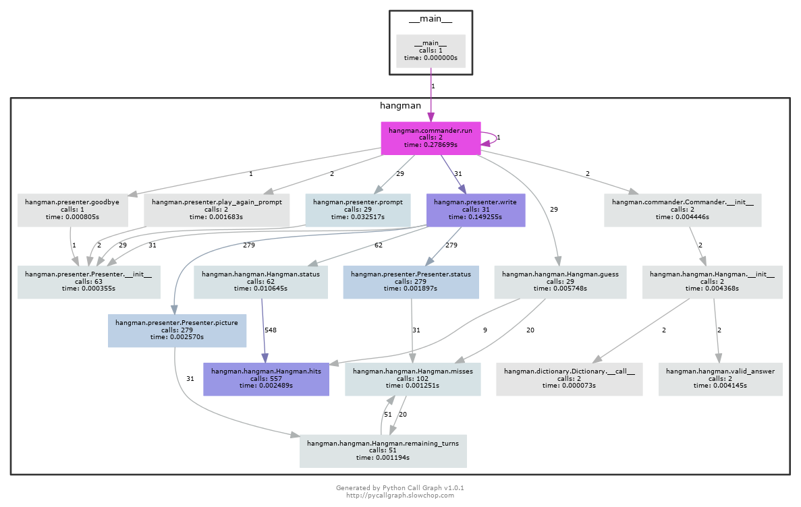

# Hangman [](https://travis-ci.org/bionikspoon/Hangman)
##### A Python TDD Experiment
My first python agnostic, tox tested, travis-backed, program!

Has **~100%** unit test coverage, with passing tests on every version of python.

**Compatibility**
- Python 2.6
- Python 2.7
- Python 3.2
- Python 3.3
- Python 3.4
- PyPy


## Usage

```sh
git clone git@github.com:bionikspoon/Hangman.git
cd Hangman/
mkvirtualenv hangman  # optional for venv users
pip install .
hangman 
```

#### Uninstall
```sh
rmvirtualenv hangman
```
or
```sh
workon hangman # for venv users
pip uninstall python-hangman
deactivate # for venv users
```

## Goal
Learning!  Python in this case.  I'm particularly interested in testing and Test Driven Development.  This was a TDD exercise.

Tox fell into my lap while figuring out setuptools so I went with it! Why not explore python agnosticism?  Making this very *simple* app python agnostic was an interesting challenge--and not so simple.  Actually, in retrospect it was.  It took changing probably less then 10 lines of code.  The real challenge was getting all these tools to work. I setup every version of python on my rig so tox could create virtualenvs with them. 

## Design
There are 3 components that LOOSELY resemble MVC--this was unintentional.

The game logic is all in one class [hangman.Hangman](hangman/hangman.py#L7).  In the MVC analogy, this would be the model.

[hangman.Commander](hangman/hangman.py#L7) is exactly that, the commander, the director, the maestro, the controller.  It tells you, the user, how to interact with the game. It does this by using the presentation layer, [hangman.Presenter](hangman/presenter.py#L6), to present the state of the game, and collect input.  The commander closes the gap between the game and the presentation layer, without convoluting the logic in either.

I chose this design pattern, because there was ambiguity in how to interact with the user.  Curses was on the table.  BUT TDD says build the simplest working product, THEN iterate features. So I did that, and ultimately went a different direction then curses.  The great thing here is that with this design, the front end can be swapped out anytime.  No problem.


## Call Diagram

