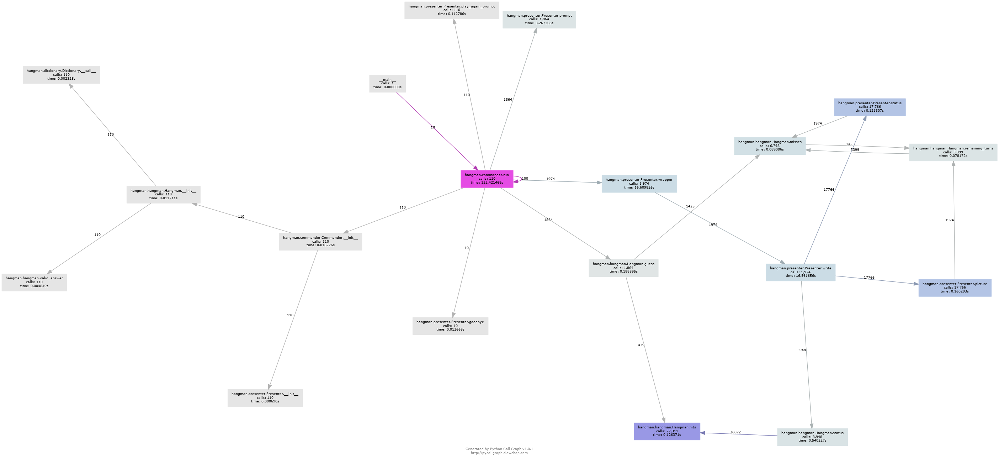

# Call Charts
uses `pycallgraph` and Graphviz to generate visual representation of the calls throughout the game.

It uses the `Mock` library to patch the user input.  Currently it's set to run the program 100/10 times, playing 10 games each.

## Charts

